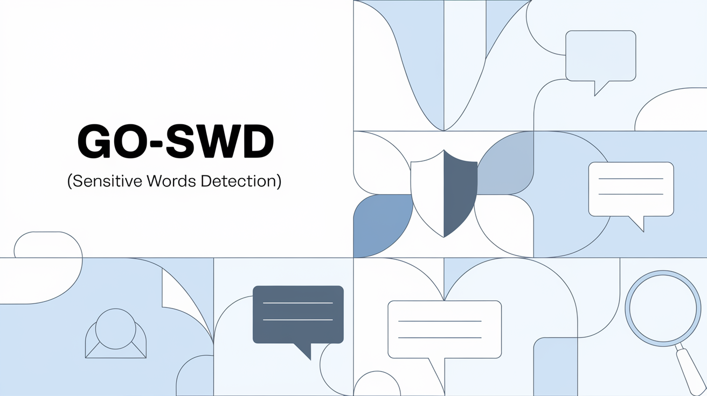

# go-swd



[](https://pkg.go.dev/github.com/kirklin/go-swd)
[](https://github.com/kirklin/go-swd/actions/workflows/ci.yml)
[](https://codecov.io/gh/kirklin/go-swd)
[](https://goreportcard.com/report/github.com/kirklin/go-swd)
[](LICENSE)

go-swd 是一个 Go 语言的敏感词检测与过滤库。它基于 Aho-Corasick 自动机，内置约四万词的中文词库，支持自定义词库、按分类过滤、白名单、文本替换，以及大小写、全半角、数字样式等字符变体的自动归一。

## 安装

```bash
go get github.com/kirklin/go-swd
```

需要 Go 1.23 或更高版本，无第三方依赖。

## 使用

```go
import "github.com/kirklin/go-swd"

engine, err := swd.New()
if err != nil {
	return err
}

engine.Detect(text)              // 是否包含敏感词
engine.MatchAll(text)            // 全部命中，含位置、标签、风险与置信度
engine.ReplaceWithAsterisk(text) // 用 * 遮盖命中
```

### 整体判定

`Check` 返回整段文本的判定：风险等级、处置建议、命中的一级分类，以及触发判定的主要标签。

```go
r := engine.Check(text)
switch r.Suggestion() {
case "block":  // 高风险，直接拦截
case "review": // 中风险，转人工复审
default:       // 放行
}
fmt.Println(r.Risk, r.Categories, r.Label.Chinese(), r.Confidence)
```

风险分四态：`RiskHigh` 建议拦截、`RiskMedium` 建议人工复审、`RiskLow` 仅在高召回场景处理、`RiskNone` 无风险。

### 自定义词库

```go
engine, err := swd.New(
	// 按二级标签加，继承该标签的分类、风险与置信度
	swd.WithLabeledWords(map[string]swd.Label{
		"示例词":  swd.ContrabandFraud,
		"多分类词": swd.PromotionToSites,
	}),
	// 按一级分类加，风险默认为高
	swd.WithWords(map[string]swd.Category{
		"自定义词": swd.UserCategory(0),
	}),
)

err = engine.AddLabeledWord("新增词", swd.PoliticalSensitive) // 返回后即对查询可见
err = engine.RemoveWord("示例词")
```

不加载内置词库：`swd.New(swd.WithoutDefaultDict())`。批量修改使用 `AddWords` 和 `RemoveWords`。

### 按分类

```go
engine.DetectIn(text, swd.Pornography, swd.Political)
engine.MatchAllIn(text, swd.All)
engine.ReplaceWithAsteriskIn(text, swd.Contraband)
engine.CheckIn(text, swd.Promotion) // 只看引流广告的判定
```

一级分类共 10 个：

| 分类 | 说明 | 二级标签 |
|---|---|---|
| `Pornography` | 色情低俗 | `pornographic_adult` `sexual_suggestive` `sexual_terms` |
| `Political` | 涉政 | `political_sensitive` `political_figure` `political_entity` |
| `Violence` | 暴恐 | `violent_extremist` `violent_incidents` `violent_weapons` |
| `Contraband` | 违禁 | `contraband_drug` `contraband_gambling` `contraband_act` `contraband_entity` `contraband_fraud` `contraband_forgery` `contraband_privacy` |
| `Inappropriate` | 不良内容 | `inappropriate_discrimination` `inappropriate_profanity` `inappropriate_oral` `inappropriate_ethics` `inappropriate_superstition` `inappropriate_nonsense` |
| `Promotion` | 引流广告 | `pt_to_sites` `pt_by_recruitment` `pt_to_contact` |
| `Religion` | 宗教 | `religion_general` |
| `AdCompliance` | 广告法 | `ad_compliance` |
| `AIGC` | AI 生成 | `aigc` |
| `Custom` | 自定义 | `customized` |

每个二级标签自带默认风险等级与基础置信度，`Label` 的方法可以查询：`Category()`、`Risk()`、`Chinese()`。`swd.Labels()` 返回全部标签。

除预定义分类外还有 21 个自定义位，用 `swd.UserCategory(n)` 取，`n` 取 0 到 20。

分类为位掩码，一个词可以同时属于多个分类，`All` 为全部预定义分类。

### 替换

```go
engine.Replace(text, '#')
engine.ReplaceWithStrategy(text, func(m swd.Match) string {
	return "[" + m.Label.Chinese() + "]"
})
```

重叠的命中会先合并为一个区间再替换。

### 字符归一化

词库和文本经过同一套折叠规则，以下写法在匹配时等价，无需配置：

| 类型 | 示例 |
|---|---|
| 大小写、全半角 | `Fuck`、`ｆｕｃｋ` |
| 数字样式 | `1`、`１`、`①`、`⁹`、`一`、`壹`、`𝟙` |
| 带圈字母、数学字母 | `Ⓐ`、`𝐚`、`🅰` |
| 带变音符的拉丁字母 | `é`、`ñ`、`ł` |

零宽字符、组合标记和变体选择符在匹配时被忽略。

可选的宽松匹配：

```go
swd.New(swd.WithMaxGap(1))             // 容忍词内的分隔符：f*u*c*k、法 轮 功
swd.New(swd.WithCollapseRepeats(true)) // 折叠重复字符：fuuuck
```

### 白名单

```go
engine, err := swd.New(swd.WithAllowWords("特色情怀"))
engine.Detect("特色情怀") // false：落在允许短语内部的命中被抑制
```

运行期使用 `AddAllowWords` 和 `RemoveAllowWords` 调整。

### 命中结果

```go
type Match struct {
	Word      string   // 词库中的原始写法
	StartPos  int      // rune 下标
	EndPos    int      // rune 下标，开区间
	ByteStart int      // 字节偏移
	ByteEnd   int      // 字节偏移，开区间
	Label      Label    // 二级标签
	Category   Category // 一级分类
	Risk       Risk     // 处置建议：高/中/低/无
	Confidence uint8    // 0-100，该词指示真实违规的可靠程度
}
```

`text[m.ByteStart:m.ByteEnd]` 是命中的原文片段。`Match` 返回最早结束的命中；`MatchAll` 按结束位置排序，包含重叠的命中；`Matches` 返回迭代器，适合大量结果。

## 并发

`Engine` 可以在多个 goroutine 中共享。查询不加锁；更新词库时重建自动机，期间的查询不受影响。

## 词库

[dict/](dict/) 目录下为内置词库：纯文本，一行一个词，`#` 开头为注释。**文件名就是二级标签**，`dict/contraband_drug.txt` 里的词全部带 `ContrabandDrug` 标签，因而自动获得对应的一级分类、风险等级与基础置信度。新增一个以标签命名的文件即可扩充词库。

词库共 15,932 词，分布在 28 个标签下。取舍依据是两份带标签的公开语料：38 万条中文新闻标题（正常文本）和 [COLD](https://github.com/thu-coai/COLDataset) 中文冒犯性语言数据集（11,754 条真实评论，人工标注冒犯与否）。

在 38 万条干净新闻标题上，按风险等级的分布：

| 风险 | 建议 | 行数 | 占比 |
|---|---|---|---|
| 高风险 | block | 490 | 0.128% |
| 中风险 | review | 719 | 0.188% |
| 低风险 | pass | 1,101 | 0.288% |
| 无风险 | pass | 380,378 | 99.396% |

在 COLD 真实评论上，按处置阈值：

| 处置阈值 | 精确率 | 召回率 |
|---|---|---|
| 仅高风险 | 79.0% | 7.3% |
| 高 + 中 | 81.5% | 11.0% |
| 任意命中 | 76.0% | 12.2% |

低风险标签（`sexual_terms` 性健康、`religion_general` 宗教、`inappropriate_oral` 低俗口头语、`ad_compliance` 广告法、`aigc`）**本来就会在正常文本里命中**，它们的作用是标注而非拦截：把性健康、宗教这类话题识别出来交给调用方判断，而不是当成违规。

召回率那一栏说明了关键词方法的边界。COLD 里的冒犯多为语境型歧视，例如「只要不来中国的外国人就是好外国人」，通篇没有敏感词。这类内容需要语义模型，任何词库都做不到；本库覆盖的是有明确词面特征的内容。


## 文档

- API 参考：[pkg.go.dev/github.com/kirklin/go-swd](https://pkg.go.dev/github.com/kirklin/go-swd)


## 赞助

如果这个项目对你有帮助，欢迎通过 [GitHub Sponsors](https://github.com/sponsors/kirklin)、[Patreon](https://www.patreon.com/kirklin) 或 [Buy Me a Coffee](https://www.buymeacoffee.com/linkirk) 支持。

## 许可证

Apache License 2.0，见 [LICENSE](LICENSE)。
